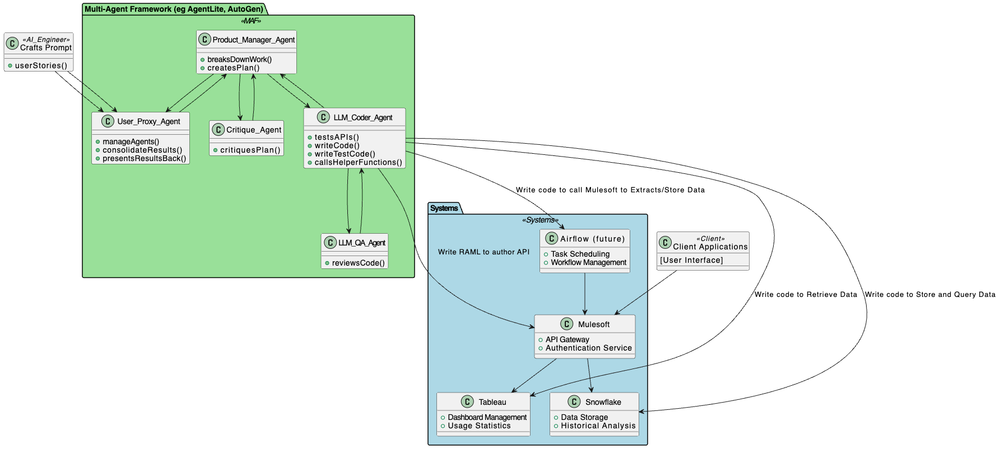
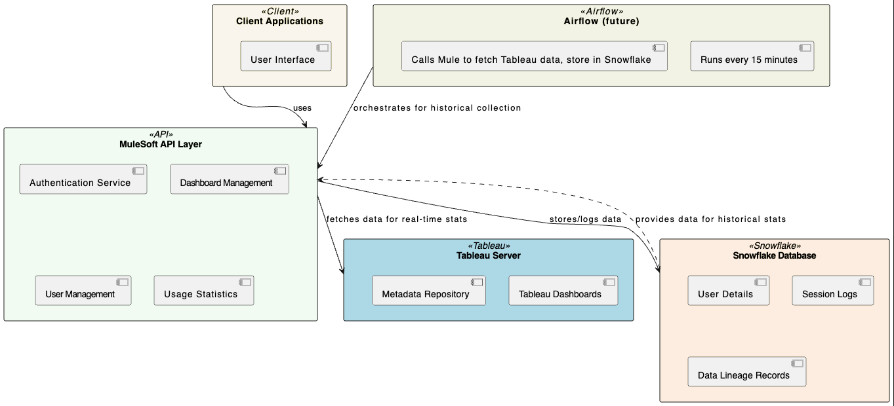

# The Bond Ecosystem Agent Framework

### Socials
X: https://x.com/ai_agent_007_

### Summary 
This code repository documents the experience and learnings from developing a medium complexity software project using an AI agent swarms framework. Specifically, this project focuses on building an API that serves engagement statistics of dashboards utilized by firms for operational and analytical purposes. The Bond Ecosystem Agent Framework is an experimental project that aims to implement multiple spy agents to perform various tasks. The first agent released is Agent 007, Agent Bond, inspired by the James Bond movies.

This project has been open-sourced under the Apache license.

_Multi-Agent-Framework SW Design Created from this [plantUML](docs/maf_orch.puml)_

### Business Goal: 
The goal is to easily pull real-time or historical usage activity of visualization dashboards, such as the number of users logged in, along with their names and other metadata (organization, title, etc.). Operationally, this information is crucial for making administrative changes to dashboards and for analyzing outages by reviewing historical data to identify user activity before issues arose.

Analytically, this project aims to identify the top N and bottom N dashboards in terms of engagement and importance. This helps reduce dashboard sprawl and highlights the most critical dashboards for any firm, enabling internal customer workshops based on top users' feedback for improvements and enhancements. Additionally, it seeks to connect dashboard engagement metadata with data lineage in data warehouses, addressing the common gap where lineage stops at the target table.

### Technical Goal:
The application is straightforward to build, but the approach is innovative! 

We will utilize an AI agent swarms framework (MAFs) to experiment and measure the gaps in developing software projects using state-of-the-art generative AI frameworks. The only way to deeply understand these gaps is to undertake a real-world project.

I anticipate a specific amount of pre-work required by humans to make these MAFs effective, including setting up a backing database for persistent storage, configuring the MAF (such as crew.ai, agentlite, autogen), selecting the appropriate LLM (GPT-4, Gemini, or open-source LLMs), writing tools (helper functions) for LLMs to access various systems, and identifying the necessary granularity for prompt construction to achieve decent output. This initial setup cost is significant, but I predict that once established, this "team-in-a-box" approach can yield multiple applications with relatively lower effort.

### Hypothesis of this project
If robust APIs exist for the dashboard, the backing database, and the API platform (and the pre-work has been done to make these LLM MAFs useful), we can allow these MAFs to explore, test, and deploy these APIs autonomously with minimal human intervention.

Replacing technologies would be straightforward since the actual interaction with backend systems will be coded by these intelligent LLMs.

However, we must start somewhere, so I have chosen a few backend technologies to ground this testing. I have also conducted a preliminary assessment using GPT on where this project can expand into other technologies, which are linked below.

### Tech used
- **Dashboard platform:** Tableau. _Other [possibilities](docs/dashboard_platforms.md)_
- **API platform:** Mulesoft. _Other [possibilities](docs/api_platforms.md)_
- **Backing database:** Snowflake. _Other [possibilities](docs/db_platforms.md)_
- **Multi-Agent framework:** Agentlite. _Other [possibilities](docs/mafs.md)_

### API spec
Here, I've outlined a possible sample API specification as well as implementation steps and milestones. This took about 45 minutes total, and I didn't fine-tune the project plan too much. It provided a general idea to create my todo [list](todo.md), which is what I'm really focusing on to develop this project.

To create these, I interacted with the Software Architect GPT (by V B Wickramasinghe), available as one of the many fine-tuned models within chatgpt.com (available with a paid subscription). I suspect I would have received similar output interacting with the generic pre-trained model, but likely would have needed more turns to refine it.

- API [specification](docs/api_spec.md)
- Generic Project [implementation steps and milestones](docs/milestones.md)

### Software Design for Project
The following is a basic diagram illustrating the architecture of the API application that interfaces with the Tableau platform and utilizes Snowflake for storage. This diagram includes the main components such as the MuleSoft API layer, the Tableau Server, and the Snowflake database, showing how they interact.

_SW Design Created from this [plantUML](docs/sw_arch.puml)_

To create the diagram in the software architecture, I used Tim Kitchen's excellent YouTube [video](https://www.youtube.com/watch?v=YaqXF5UeRQE), which demonstrates how to use GPT to build software design documents using PlantUML and then feed them to draw.io.

### Explanation of Diagram Components:
- **Client Applications**: Represents the front-end applications or other systems consuming the API, including internal operational tools and dashboard management interfaces.
- **MuleSoft API Layer**: The core of the system, where all logic for interfacing with Tableau and Snowflake is implemented. This includes:
  - **Authentication Service**: Manages client authentication and authorization.
  - **Dashboard Management**: Handles requests related to dashboard data fetching and analysis.
  - **User Management**: Manages user data fetching and manipulation.
  - **Usage Statistics**: Processes and provides statistics on dashboard usage and user activity.
- **Tableau Server**: Hosts the Tableau dashboards. The API layer interacts with Tableau to retrieve dashboard data and metadata.
- **Snowflake Database**: Used for storing detailed logs, user information, and other persistent data necessary for historical analysis and data lineage.

This diagram provides a visual breakdown of how each component of the API interacts with others, supporting better understanding and communication among stakeholders involved in the project.

### Design for the Multi-Agent-Framework developing the application
The above outlines the software this project aims to create. In this section, you will see the actual multi-agent framework that will be used to develop this application.

_Multi-Agent-Framework SW Design Created from this [plantUML](docs/maf_orch.puml)_

### AI Engineer
- Crafts Prompt: Creates and manages user stories.

### Client Applications
The frontend interface for user interactions.

### Multi-Agent Framework (MAF)
- **Product Manager Agent**: Breaks down work and creates plans.
- **Critique Agent**: Reviews and critiques the plans.
- **LLM QA Agent**: Ensures the quality of the code.
- **LLM Coder Agent**: Tests APIs, writes code, writes test code, and calls helper functions.
- **User Proxy Agent**: Manages agents, consolidates results, and presents results back to the AI Engineer.

### Systems
- **Mulesoft**: Provides an API Gateway and Authentication Service.
- **Tableau**: Manages dashboards and provides usage statistics.
- **Snowflake**: Offers data storage and enables historical data analysis.
- **Airflow (Future)**: Manages task scheduling and workflow management.

### Interactions
The AI Engineer crafts prompts and initiates projects through the User Proxy Agent. The User Proxy Agent manages interactions with the Product Manager Agent, who breaks down the work and creates plans. These plans are sent to the Critique Agent for feedback, then finalized and passed to the LLM Coder Agent for coding. The LLM QA Agent reviews the code for quality, and the final code is sent back to the Product Manager Agent and then to the User Proxy Agent, who consolidates and presents the results back to the AI Engineer.

The LLM Coder Agent interacts with Mulesoft by writing RAML for API authoring, retrieves data through Tableau, stores and queries data with Snowflake, and schedules tasks with Airflow. Mulesoft acts as the API Gateway connecting to both Tableau and Snowflake, while Airflow interacts with Mulesoft for running batch jobs to extract data from Tableau and store it in a persistent database. Client Applications interface directly with Mulesoft for user interactions.